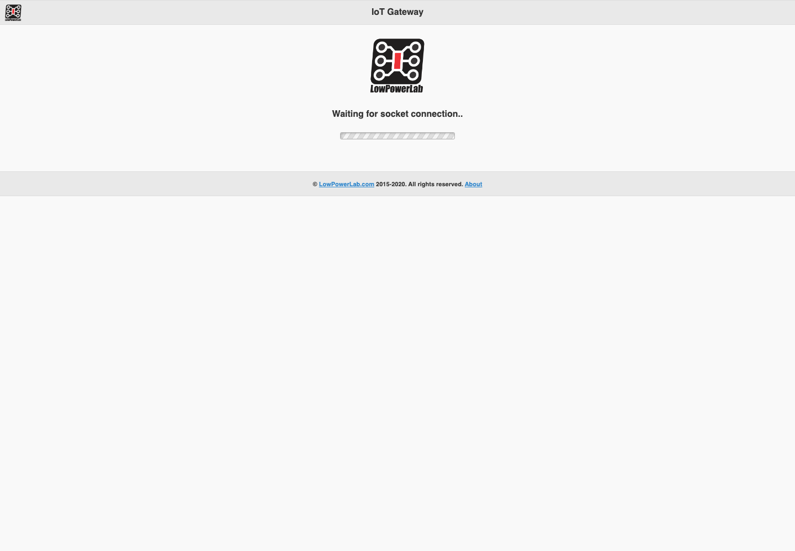
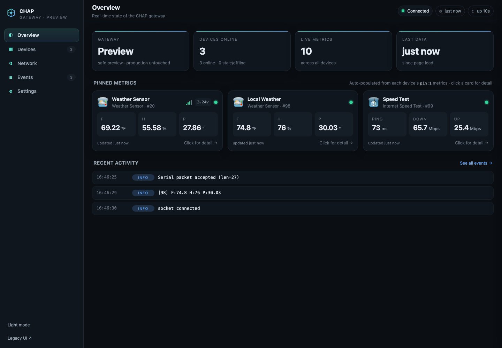

RaspberryPi Gateway Home Automation & IoT Applications
----------------
[](https://app.travis-ci.com/LowPowerLab/RaspberryPi-Gateway)
[](https://github.com/LowPowerLab/RaspberryPi-Gateway)
[](https://github.com/LowPowerLab/RaspberryPi-Gateway/issues)
[](https://github.com/LowPowerLab/RaspberryPi-Gateway/pulls)
[](https://creativecommons.org/licenses/by-nc-sa/4.0/)

Designed and coded by [Felix Rusu](lowpowerlab.com/contact), Low Power Lab LLC
<br/>

### Features:
- HTTPS secured with self signed certificate
- HTTP `auth_basic` authentication
- responsive & mobile friendly design
- realtime updated via socket.io websockets & node.js backend 
- [neDB](https://github.com/louischatriot/nedb) storage of node data and logs
- [flot](http://flotcharts.org/) front end graphs
- [nconf](https://github.com/indexzero/nconf) for easy global variable configuration maintenance
- [nodemailer](https://github.com/andris9/Nodemailer) for sending email (and SMS relayed via email)
- [Font-awesome](http://htmlpreview.github.io/?https://github.com/dotcastle/jquery-mobile-font-awesome/blob/master/index.html) icons for jQuery-Mobile

### LICENSE
This project is released under [CC-BY-NC 4.0](https://creativecommons.org/licenses/by-nc/4.0/).<br/>
The licensing TLDR; is: You are free to use, copy, distribute and transmit this Software for personal, non-commercial purposes, as long as you give attribution and share any modifications under the same license. Commercial or for-profit use [requires a license](https://lowpowerlab.com/contact).
For more details see the [LICENSE](https://github.com/LowPowerLab/RaspberryPi-Gateway/blob/master/LICENSE)

### Details & Setup Guide
Please see the [PiGateway Guide](https://lowpowerlab.com/guide/gateway/) for all details requires to install this software.

### Video Overview & Demo
https://www.youtube.com/watch?v=F15dEqZ4pMM

### 3rd party custom gateway setup overview
https://www.youtube.com/watch?v=DP83RJeTpUY

## Modern development and deployment

The GitHub repository is the source of truth. The Raspberry Pi should run a
clean checkout of a reviewed commit; credentials, runtime configuration,
databases, logs, and TLS keys must remain outside Git.

The supported runtime is pinned in `.nvmrc` (`Node.js v17.4.0`, matching the
current Pi 3 deployment and `serialport~9.0.7`). Install and test with:

```bash
nvm install
nvm use
npm ci
npm test
```

The test command exercises fixture coverage for every bundled node module
without opening the serial device or modifying a database.

### UI modernization: before and after

The existing gateway UI remains available at `/legacy` during the migration.
The modernization adds a responsive dashboard with live metric cards, device
navigation, event activity, node detail drawers, sparklines, controls, and a
settings editor.

| Legacy UI | Modern UI |
| --- | --- |
|  |  |

These images were captured from the upstream legacy baseline and the safe
preview server. The modern screen is a replay-backed preview; it does not
claim that the production Pi has already been cut over.

### One-command local setup

Use the checked-in helper for a test-only setup or a hardware-free UI preview:

```bash
./setup.sh test
./setup.sh preview
```

The preview listens on HTTPS port `17443` and uses the development credentials
`chap` / `chap`. Open `https://localhost:17443/`; the original interface is at
`https://localhost:17443/legacy/`. The preview never opens the serial device or
writes the production database. Use `./setup.sh gateway` only on the Pi, after
backing up its configuration and data and confirming the required native
`serialport` module is available for that Node/architecture combination.

### Health and live telemetry

The gateway exposes an authenticated `/healthz` endpoint through nginx. It
reports the running version, uptime, replay status, serial port, and age of
the last telemetry packet. The `/httpendpoint/` route accepts the existing
query-string ingestion format and broadcasts accepted values to connected
Socket.IO clients.

### Safe serial replay

Replay mode lets a second instance exercise the UI and realtime pipeline
without opening the production radio device:

```bash
GATEWAY_DB_DIR=data/replay-db \
GATEWAY_SOCKET_PORT=8180 \
GATEWAY_HTTP_ENDPOINT_PORT=8181 \
GATEWAY_REPLAY_FILE=test/fixtures/weather.log \
GATEWAY_REPLAY_INTERVAL_MS=2000 \
npm start
```

Use a separate nginx location or SSH tunnel for the replay ports. Never point
the replay instance at the production `data/db` directory.

### Authentication guidance

The current deployment uses nginx TLS plus HTTP Basic Authentication and an
htpasswd file. This is acceptable for a private LAN when the Pi firewall and
nginx allowlist are maintained, but it is not appropriate to expose directly
to the public Internet. For any externally reachable ingestion endpoint, set
`GATEWAY_API_TOKEN`; `/healthz` and `/httpendpoint/` then require:

```text
Authorization: Bearer <token>
```

Use a long random token stored in the service environment or a root-readable
environment file, never in `settings.json5` or Git. A future auth upgrade
should replace Basic Auth with an identity-aware reverse proxy or mutual TLS,
while preserving the private-LAN deployment option.

### Production deployment workflow

1. Review and merge the GitHub pull request.
2. On the Pi, back up `data/`, `settings.json5`, `data/secure/`, and the systemd/nginx configuration.
3. Fetch the merged commit into a release directory.
4. Run `npm ci` and `npm test` before switching the service.
5. Stop the service briefly, switch the `/home/pi/gateway` symlink or checkout, and start it again.
6. Verify `/healthz`, the UI, Socket.IO updates, and a real weather packet.
7. Keep the previous release available for rollback until telemetry has been confirmed.
